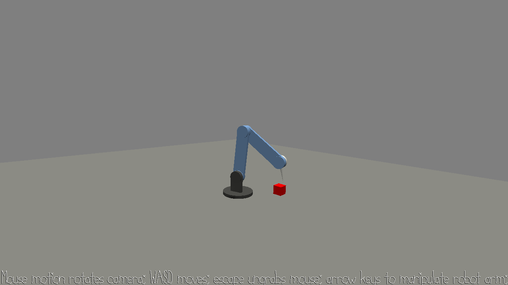

# 15-466 Game 2: Arm Manipulator

Author: Jason Xu

Design: A game to manipulate a robot arm to reach the location of cubes generated at random locations.

Screen Shot:

How To Play:

Use WASD and mouse to move the camera, and arrow keys to move the arm. Left and right keys control rotation of the base joint at the bottom of the arm, and up and down keys control the up and down of the 3 other joints. Pressing SPACE can change the joint that is manipulated.

The goal is to reach the red cube in the game's space with the end of the arm's gripper. When the cube is reached, the cube will be randomly repositioned to a new location within reach of the robot arm.

This game was built with [NEST](NEST.md).
